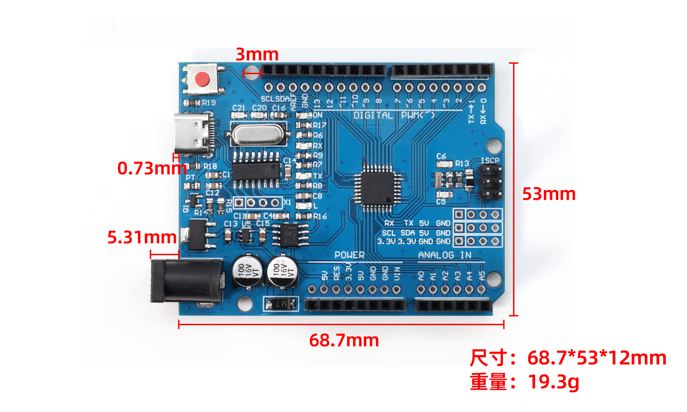
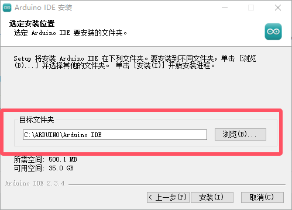
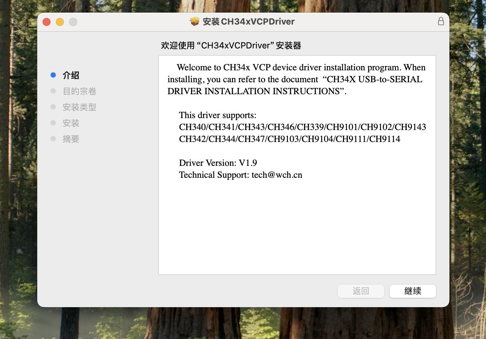

MB0175 UNO R3 BOARD
===================

|image1|

概述
----

UNO R3 BOARD的处理器核心是ATMEGA328P-AU，它和官网的ARDUINO UNO
REV3完全兼容。它同时具有14路数字输入/输出口（其中6路可作为PWM输出），6路模拟输入，1个16MHz晶体振荡器，1个USB口，1个电源插座，1个ICSP接口和一个复位按钮。

其中1个ICSP可给ATMEGA328P-AU烧录固件，由于这个芯片我们在出厂前都以烧录好固件，所有一般不用。使用时我们可以利用USB线供电，利用黑色DC头外部供电（DC
7-12V），还可以利用排母接口Vin GND（DC 7-12V）供电。

模块参数
--------

1.  主控芯片：ATMEGA328P-AU
2.  工作电压：5v
3.  输入电压：DC 7- 12V （推荐）DC-9V
4.  数字I/0引脚：14 (DO-D13)
5.  PWM数字I/0引脚：6 （D3 D5 D6 D9 D10 D11）
6.  模拟输入引脚：6 （A0-A5）
7.  直流电流每I/0引脚：20 MA
8.  DC 3.3V电流引脚：50MA
9.  闪存：32 KB （ATMEGA328P-AU）其中0.5 KB使用的bootloader
10. SRAM:2 KB (ATMEGA328P-AU)
11. EEPROM: 1 KB （ATMEGA328P-AU）
12. 时钟速度：16 MHz
13. LED_BUILTIN:D13
14. 开发板尺寸：68.7MM×53MM×12MM
15. 开发板重量：19.3G
16. 工作温度：0℃~50℃

|image2|

产品接口和主要器件说明图例
--------------------------

|image3|

+----+--------------+------------------------------------------------+
| 1  | ICSP引脚     | 是一个AVR，一个由MOSI，MISO，                  |
|    |              | SCK，RESET，VCC和GND组成的的微型编程头。它通常 |
|    |              | 被称为SPI（串行外设接口），可以被认为是输出的“ |
|    |              | 扩展”。实际上，你是将输出设备从属到SPI总线的主 |
|    |              | 机。连接电脑时，可以给ATMEGA328P-AU烧录固件。  |
+====+==============+================================================+
| 2  | 数字I/O      | 有14个数字I/O引脚（D0-D                        |
|    |              | 13）（其中6个提供PWM（脉宽调制）输出），这些引 |
|    |              | 脚可配置为数字输入引脚，用于读取逻辑值（0或1） |
|    |              | ；或作为数字输出引脚来驱动不同的模块，         |
|    |              | 如LED，继电器等。标有“〜”的引脚可用于产生PWM。 |
+----+--------------+------------------------------------------------+
| 3  | 地线         | GND                                            |
+----+--------------+------------------------------------------------+
| 4  | AREF         | 代表模拟参考。它有时用于设置外部               |
|    |              | 参考电压（0至5伏之间）作为模拟输入引脚的上限。 |
+----+--------------+------------------------------------------------+
| 5  | SDA          | IIC通信接口 SDA                                |
+----+--------------+------------------------------------------------+
| 6  | SCL          | IIC通信接口 SCL                                |
+----+--------------+------------------------------------------------+
| 7  | 复位按键     | 可以重置你的控制板                             |
+----+--------------+------------------------------------------------+
| 8  | D13指示灯    | 当                                             |
|    |              | D13为高电平时，LED亮起，为低电平时，LED熄灭。  |
+----+--------------+------------------------------------------------+
| 9  | TYPE-C接口   | 接到电脑USB端                                  |
|    |              | 口，可以给控制板供电，还可以给控制板上传程序。 |
+----+--------------+------------------------------------------------+
| 10 | 发送指示灯TX | 控制板通过串口通信，发送信息时，TX灯闪烁。     |
+----+--------------+------------------------------------------------+
| 11 | 接收指示灯RX | 控制板通过串口通信，接收到信息时，RX灯闪烁。   |
+----+--------------+------------------------------------------------+
| 12 | 晶体振荡器   | 它告诉我们，频率是16,000,000赫兹或16MHz。      |
+----+--------------+------------------------------------------------+
| 13 | 稳压器       | 它将外部输入的DC 7-12V电压转化成DC             |
|    |              | 5V电压，然后将DC 5V电压                        |
|    |              | 转送给处理器和其他元件。                       |
+----+--------------+------------------------------------------------+
| 14 | DC7-12V      | 给控制板输入DC 7-12V 外接电源供电。            |
+----+--------------+------------------------------------------------+
| 15 | RESET        | 可外接按键，和复位按键功能一样。               |
+----+--------------+------------------------------------------------+
| 16 | 3.3V输出     | 提供DC 3.3V 输出电压。                         |
+----+--------------+------------------------------------------------+
| 17 | 5V输出       | 提供DC 5V 输出电压。                           |
+----+--------------+------------------------------------------------+
| 18 | 模拟引脚     | 6个模拟引脚A0-A5。当数字引脚不够时，也可以当   |
|    |              | 做数字引脚，其中A0相当于D14，A1相当于D15,A2相  |
|    |              | 当于D16,A3相当于D17,A4相当于D18,A5相当于D19。  |
+----+--------------+------------------------------------------------+
| 19 | 微控制器     | 每个                                           |
|    |              | 控制板板都有自己的微控制器。你可以假设它作为板 |
|    |              | 的大脑。微控制器通常是ATMEL公司的。在从Arduino |
|    |              | IDE加载新程序之前，你必须知道你的板上有        |
|    |              | 什么IC，这个控制板的微控制器是ATMEGA328P-AU。  |
+----+--------------+------------------------------------------------+

产品特殊接口及功能说明或注意事项
--------------------------------

串口通信接口：D0为RX、D1为TX

PWM接口（脉宽调制）：D3 D5 D6 D9 D10 D11

外部中断接口：D2(中断0)和D3 (中断)

SPI通信接口：D10为SS、D11为MOSI、D12为MISO、D13为SCK

IIC通信端口：A4为SDA、A5为SCL

产品使用说明
------------

下载安装Arduino IDE(WIN10/MAC)
~~~~~~~~~~~~~~~~~~~~~~~~~~~~~~

拿到这个控制板后，我们首先需要下载安装Arduino IDE。

你可以进入以下网址下载Arduino IDE：\ https://www.arduino.cc/en/software/
进入到这里,根据自己电脑系统选择不同的下载软件\ |image4|

就可以下载最新的2.3.4版本IDE了.如果出现下面了这个界面，就选择\ |image5|\ ，直到他开始下载就可以啦
，如果没有的话请直接忽略.!\ |image6|

安装过程就很简单了，一直点我同意或者下一步就行了\ |image7|

注意，到了这一步的时候我们要记住安装路径，确保自己下次可以找到这个文件,确定没问题就点击安装。

|image8|

到了这里Arduino IED已经下载安装好啦 。

下载USB芯片驱动
~~~~~~~~~~~~~~~

接下来就是下载CH340驱动了，，驱动提取链接:
https://www.wch.cn/downloads/category/67.html

第一步我们选择和自己板子一样的芯片型号，第二步根据自己的电脑系统选择合适的驱动下载。

|image9|

WINDOWS版本驱动
^^^^^^^^^^^^^^^

选择Windows版本的驱动点击进去后，我们选择下载，随后在右上角找到下载图标，打开下载的文件。

|image10|

打开文件后我们点击安装就可以。

|image11|

随后我们检查一下驱动安装是否成功，将控制板用USB线连接在电脑上后我们要寻找到设备管理器，在电脑桌面的左下角有个\ |image12|\ ，点击之后我们找到此电脑，随后右击鼠标，是右击鼠标哦！选择更多，点击管理。

|image13|

点击之后我们就可以找到设备管理器啦

|image14|

下图的样子是安装失败的显示，需要重新安装或者换个接口试试，如果成功，请跳过这张。

|image15|

确保设备管理器中显示的端口如图所示就代表安装成功了

|image16|

MAC版本驱动安装
^^^^^^^^^^^^^^^

选择适合MAC的软件下载，进去到其中后我们点击下载，随后在下载栏中找到自己的下载的软件。\ |image17|

打开安装包后我们就可以获得这三个文件，切记！！三个文件要放在一个文件夹里！！！随后我们点击后缀为PKG的文件进行安装。

|image18|

接下来还是一样的，继续，下一步，安装三部曲就好啦，不过还是要注意，安装的位置一定要清楚哦。

|image19|

|image20|

Arduino IDE代码烧入
~~~~~~~~~~~~~~~~~~~

首先我们点击\ |image21|\ 图标，打开Arduino
IDE，按照图片顺序依次选择我们的开发板和端口（一定要选择正确的开发板和端口哦，不然是无法连接的！！)

|image22|

先输入我们板子的关键字，随后选择正确的开发板，在选择对应的端口，没问题后点击确定。\ |image23|

随后我们Ctrl+N或者点击\ |image24|\ 后找到新建项目，得到下面界面。

|image25|

将代码复制进去，注意，一定要将原来的代码全部删除干净哦！

::

   int val;     //设置变量
   int ledpin=13;  //设置led引脚为13

   void setup()
   {
     Serial.begin(9600);    //设置波特率
     pinMode(ledpin,OUTPUT);   //设置引脚模式
   }

   void loop()
   {
     val=Serial.read();    //将串口赋值参数
     if(val=='R')          //进行串口参数条件判断
       {
       digitalWrite(ledpin,HIGH);    //灯亮
       delay(500);                  //等待500毫秒
       digitalWrite(ledpin,LOW);     //灯灭
       delay(500);                 //等待500毫秒
       Serial.println("Hello World!");   //串口输出Hello World!
       }
   }

一切没问题之后，我们就要开始编译和烧入程序啦，按照顺序点击 |image26|
，出现下面框选的东西（这是代表程序没有问题，要是没有出现下面输出框框内的东西要检查代码是否正确哦)，之后再次点击\ |image27|

|image28|

这个时候打开我们的串口监视器，检查波特率是否和我们代码的波特率一致，没问题之后输入R,键盘按Enter，下面窗口就会弹出Hello
World!，同时我们的板子灯也会闪烁一下！

|image29|

|image30|

常见问题解决方法
----------------

串口无法连接：
~~~~~~~~~~~~~~

1.需要检查驱动是否安装成功，重新安装CH340驱动.

2.需要看看type-c接口调换一下，或者电脑接口重新拔插一下，再或者换跟数据线试试.

产品代码烧入失败
~~~~~~~~~~~~~~~~

1.检查开发板和端口是否选择正确，重新选择对应端口和开发板.

2.看看代码是否正确，将文本代码复制粘贴进去看看.

3.检查接口是否松动，将接口重新拔插.

4.关闭软件重新打开或者重启电脑.

产品重要芯片的规格书下载
------------------------

:download:`ATMEGA328P数据手册 <./规格书/ATMEGAP.7z>`

:download:`CH340C数据手册 <./规格书/CH340C.7z>`

.. |image1| image:: ./media/1.1.jpeg

.. |image6| image:: ./media/5.2.png

.. |image10| image:: ./media/5.6.png
.. |image11| image:: ./media/5.7.png
.. |image12| image:: ./media/5.3.5.png
.. |image13| image:: ./media/5.8.png
.. |image14| image:: ./media/5.9.png
.. |image15| image:: ./media/5.10.png
.. |image16| image:: ./media/5.11.png
.. |image17| image:: ./media/5.12.png
.. |image18| image:: ./media/5.13.png

.. |image20| image:: ./media/5.15.jpeg
.. |image21| image:: ./media/5.1.2.png

